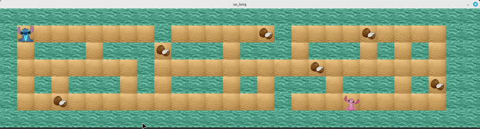

# so_long - A 2D Interactive Game

<p align="center">
  
</p>

## Overview
**so_long** is a small 2D game project developed in **C** using the **MiniLibX** graphics library. The objective is to create a top-down game where the player must collect all items on a map before reaching the exit, avoiding obstacles, all while tracking the total number of movements. This project serves as an introduction to basic 2D graphics, texture rendering, event handling, and window management.

## Technical Features
* **Map Parsing & Validation:** Reads `.ber` map files and rigorously checks for rectangular shape, closed walls, and valid paths to all collectibles and the exit.
* **Graphics Rendering:** Utilizes MiniLibX to render textures, sprites, and tiles onto the game window frame by frame.
* **Event Handling:** Captures keyboard inputs (W, A, S, D or Arrows) for movement and properly handles window closure events (`Esc` or the window 'X' button) to prevent memory leaks.
* **Custom Printf:** Integrates a custom `ft_printf` implementation to log the current move count to the terminal dynamically.
* **Memory Management:** Ensures all allocated memory for maps, images, and window pointers is completely freed upon exit.

## Installation & Compilation

This project relies on the `minilibx-linux` graphics library, which is included as a Git Submodule.

1. Clone the repository with its submodules:
```bash
git clone --recurse-submodules <your-repo-link>
cd so_long
```
*(If you already cloned it without submodules, run: `git submodule update --init`)*

2. Compile the game:
```bash
make
```

3. Run the game with a valid map:
```bash
./so_long maps/map.ber
```

## Controls

* **W** : Move Up
* **S** : Move Down
* **A** : Move Left
* **D** : Move Right
* **ESC** : Exit the game cleanly

## Directory Structure
```text
so_long/
├── assets/          # Media assets for documentation
├── ft_printf/       # Custom printf library
├── inc/             # Header files (so_long.h)
├── maps/            # Valid and invalid .ber map files for testing
├── minilibx-linux/  # Graphics library (Git Submodule)
├── srcs/            # Core source code
│   ├── graphics/    # Image and texture rendering (images.c)
│   ├── logic/       # Game engine and core loop (main.c, game.c, game_close.c)
│   ├── map/         # Map parsing and validation (map_read.c, map_control.c, coordinats.c)
│   └── utils/       # Helper functions and memory freeing (frees.c, ft_split.c, ft_substr.c)
├── textures/        # .xpm sprite files
├── .gitmodules      # Submodule tracking file
├── Makefile         # Build automation
└── README.md        # Project documentation
```